# Anime-Sketch-Colorizer

Automatic Sketch Colorization with reference image

Prerequisites
------

  `pytorch`
  
  `torchvision`
  
  `numpy`
  
  `openCV2`
  
  `matplotlib`
    
Dataset
------

  Taebum Kim, "Anime Sketch Colorization Pair", https://www.kaggle.com/ktaebum/anime-sketch-colorization-pair
    
Train
------

  Please refer `train.ipynb`
  
Test
------

  Please refer `test.ipynb`
  
* You can download pretrained checkpoint on https://drive.google.com/open?id=1pIZCjubtyOUr7AXtGQMvzcbKczJ9CtQG (449MB)
  
Training details
------

| 
Parameter
 | 
Value
 |
|:--------|:--------:|
| Learning rate | 2e-4 | 
| Batch size | 2 | 
| Epoch | 25 | 
| Optimizer | Adam |
| (beta1, beta2) | (0.5, 0.999) |
| (lambda1, lambda2, lambda3) | (100, 1e-4, 1e-2) |
| Data Augmentation | RandomResizedCrop(256) RandomHorizontalFlip() |
| HW | CPU : Intel i5-8400 RAM : 16G GPU : NVIDIA GTX1060 6G |
| Training Time | About 0.93s per iteration (About 45 hours for 25 epoch) |

Model
------

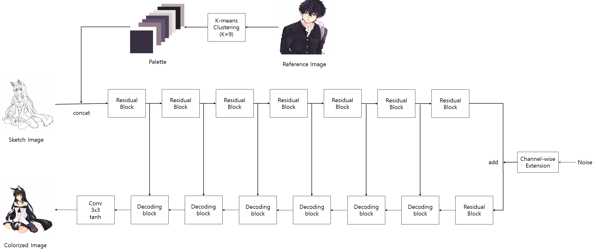
 
 For more details, please refer `Model_details.pdf`
 
Results
-----

Reference / Sketch / Colorization Result / Ground Truth
  

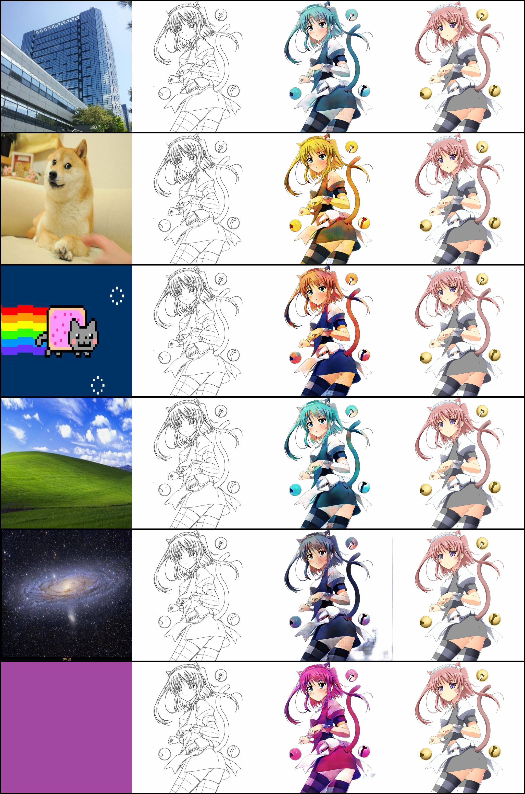
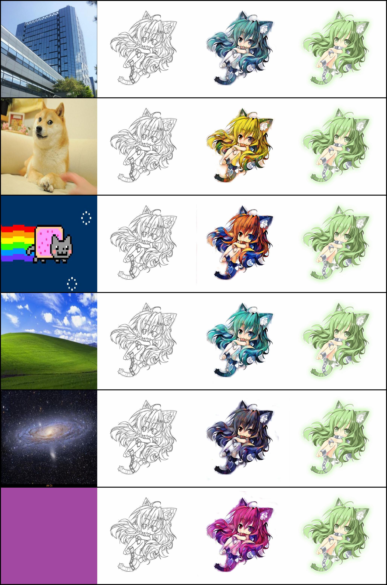
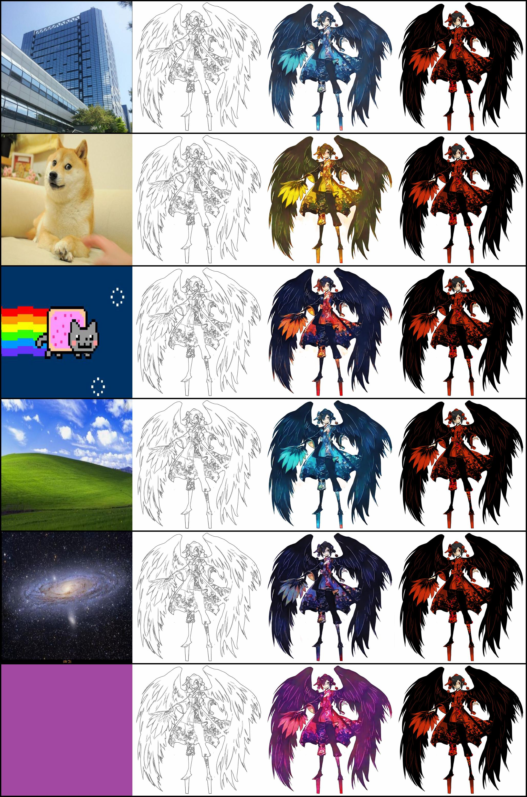
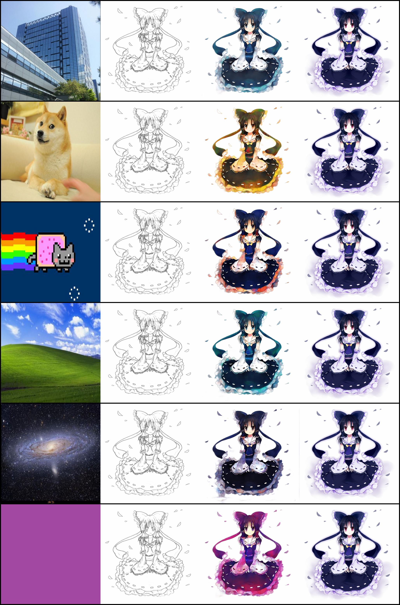
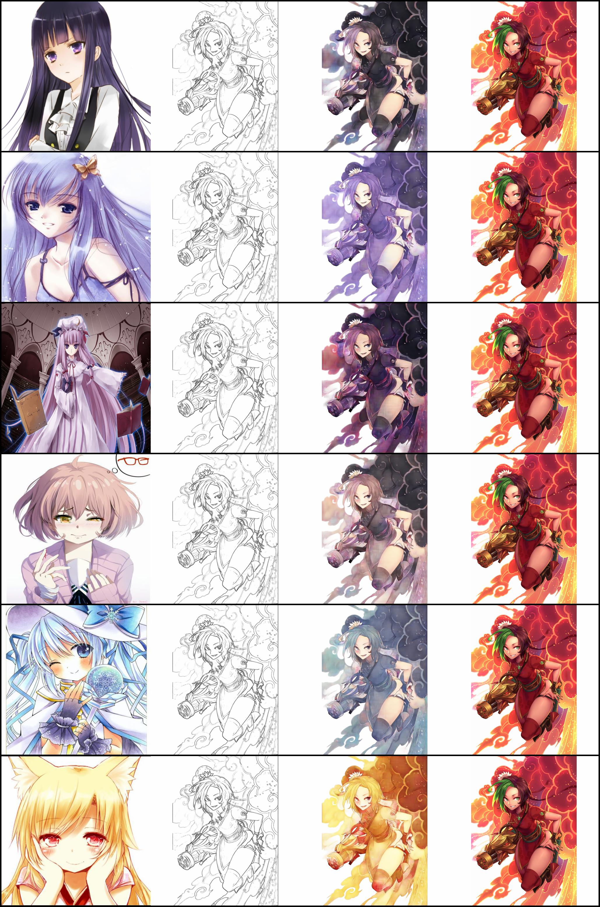
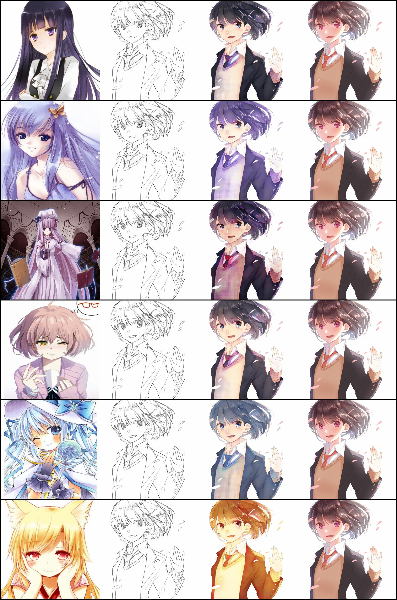
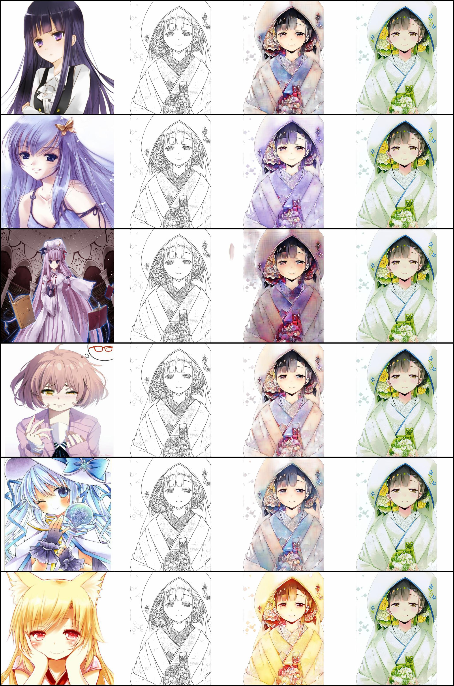
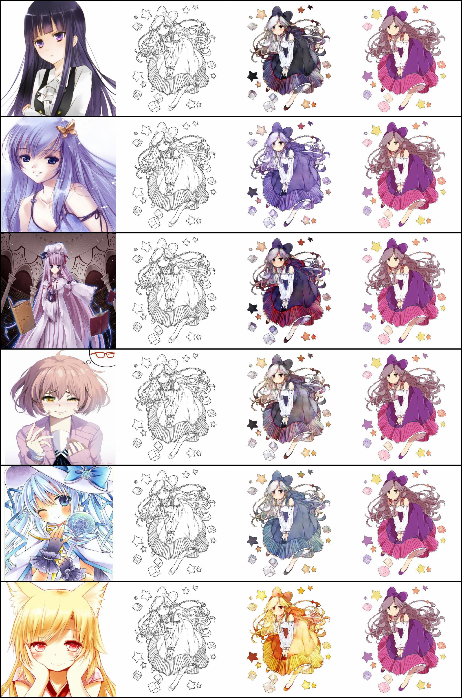
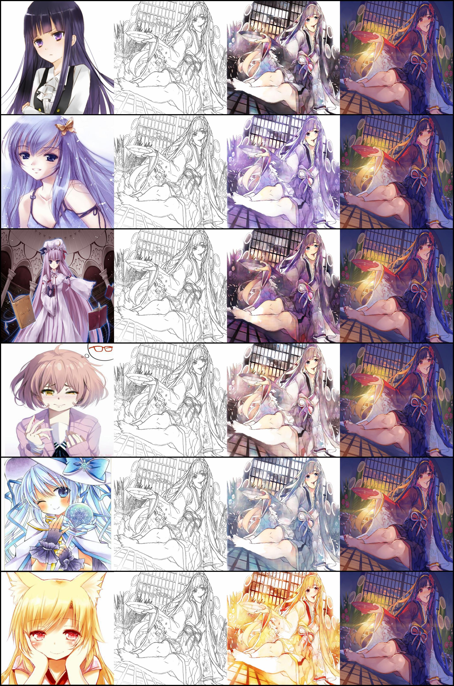
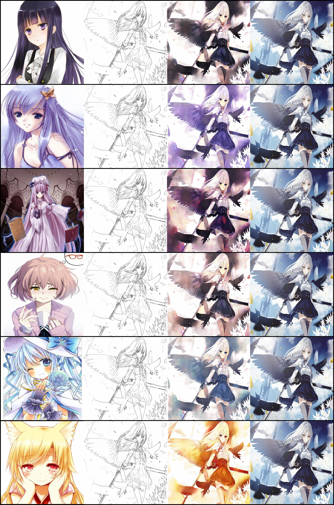
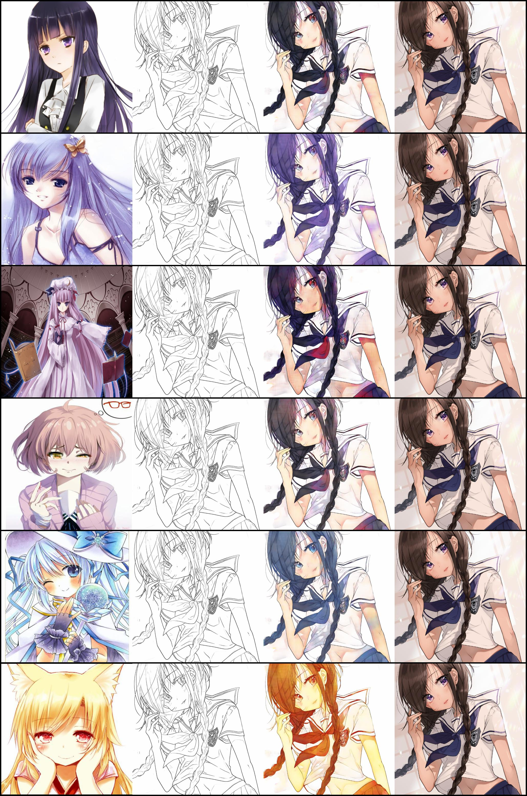
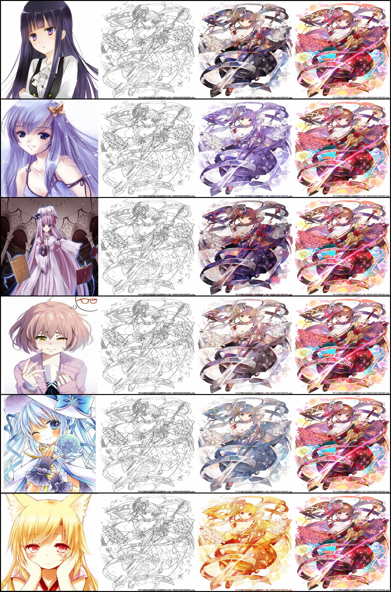
 
Reference
------

 [1] Taebum Kim, "Anime Sketch Colorization Pair", https://www.kaggle.com/ktaebum/anime-sketch-colorization-pair, 2019., 2020.1.13.
 
 [2] Jim Bohnslav,"opencv_transforms", https://github.com/jbohnslav/opencv_transforms, 2020.1.13.
 
 [3] Takeru Miyato et al., "Spectral Normalization for Generative Adversarial Networks", ICLR 2018, 2018.2.18.
 
 [4] Ozan Oktay et al., "Attention U-Net: Learning Where to Look for the Pancreas", MIDL 2018, 2018.5.20.
 
 [5] Siyuan Qiao et al., "Weight Standardization", https://arxiv.org/abs/1903.10520, 2019. 3. 25., 2020.1.19.
 
 [6] Tero Karras, Samuli Laine, Timo Aila, "A Style-Based Generator Architecture for Generative Adversarial Networks", https://arxiv.org/abs/1812.04948, 2019.3.29., 2020.1.22.
